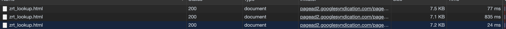
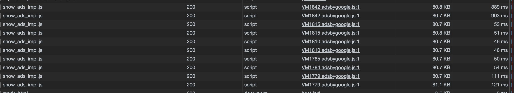
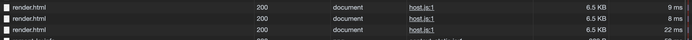
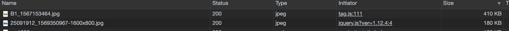
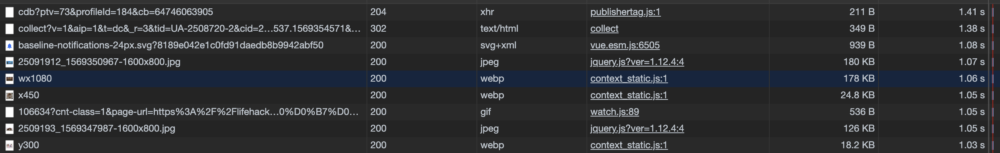

<h2>Вкладка NETWORK</h2>
<h3>1 - Дублирование ресурса</h3>

1.1 - Происходит 3 раза загрузка html файла, хоть и размер небольшой но в итоге нагрузка имеется 
         

1.2 Из разных мест в коде происходит загрузка скрипта в количестве 10 раз, что введет к нагрузке на сайт
         

1.3 3 Происходит 3 раза загрузка файла js
         

<h3>2 - лишний размер ресурса</h3>

2.1 - Загрузка картинки `B1_1567153464.jpg` размер у которой 430кб,
      это самая большая картинка при загрузке сайта.  
        

<h3>3 - медленно загружающиеся ресурсы</h3>

3.1 На скриншоте приведены все ресурсы которые загружаются дольше чем 1 сек, и это при скорости в 200мб/с если уменьшим скорость, 
 то и скорость загрузки у нас уменьшится. В эти ресурсы входят:POST запрос, загрузка картинок
    